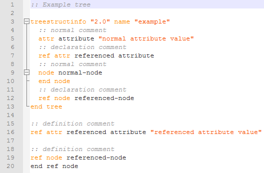

# TreeStructInfoDSL
## 1. Note about the project
##### - why?
Desired effect: 



Vanilla TreeStructInfo:
```delphi
with TTSInfoTree.Create do
try
  RenameTree('example');
  WriteTreeComment('Example tree', '');
 
  CreateAttribute('', False, 'attribute');
  WriteString('attribute', 'normal attribute value');
  WriteAttributeComment('attribute', 'normal comment', '', ctDeclaration);
 
  CreateAttribute('', True, 'referenced attribute');
  WriteString('referenced attribute', 'referenced attribute value');
  WriteAttributeComment('referenced attribute', 'declaration comment', '', ctDeclaration);
  WriteAttributeComment('referenced attribute', 'definition comment', '', ctDefinition);
 
 
  CreateChildNode('', False, 'normal-node');
  WriteChildNodeComment('normal-node', 'normal comment', '', ctDeclaration);
 
  CreateChildNode('', True, 'referenced-node');
  WriteChildNodeComment('referenced-node', 'declaration comment', '', ctDeclaration);
  WriteChildNodeComment('referenced-node', 'definition comment', '', ctDefinition);
finally
  ExportTreeToFile('vanilla-tsi.tsinfo');
  Free;
end;
```

TreeStructInfoDSL:
```delphi
with TreeStructInfo(
  Name('example'),
  Comment('Example tree'),
 
  Nodes([
    Node(
      Name('normal-node'),
      Comment('normal comment')),
 
    RefNode(
      Name('referenced-node'),
      DeclarationComment('declaration comment'),
      DefinitionComment('definition comment'))
  ]),
 
  Attributes([
    Attribute(
      Name('attribute'),
      Comment('normal comment'),
      Content('normal attribute value')),
 
    RefAttribute(
      Name('referenced attribute'),
      DeclarationComment('declaration comment'),
      DefinitionComment('definition comment'),
      Content('referenced attribute value'))
  ])
) do
begin
  ExportTreeToFile('tsidsl.tsinfo');
  Free;
end;
```

## 2. How to install
```$ git clone --recursive https://github.com/spartanPAGE/TreeStructInfoDSL``` 
For more, check [instalation guide](docs/installation/guide.md)

## 3. How to use
Basic usage:
```delphi
TreeStructInfo(
  Name('DSL!'),
  Comment('Well, it is not exatcly a DSL. Thats a prothesis. But hey, it works!'),
  Nodes([
    Node(
      Name('normal node'),
      Comment('nested')),

    RefNode(
      Name('ref node'),
      DeclarationComment('Want to create a comment for the declaration? Go on.'),
      DefinitionComment('For a definition? No problem.'))
  ]),
  Attributes([
    Attribute(
      Name('limitations'),
      Comment('(im talking about separation of nodes and attributes)'),
      Content('There will be none in a near future!')),

      RefAttribute(
        Name('...'))
  ])
)
```
Generated tree:
```bash
:: Well, it is not exatcly a DSL. Thats a prothesis. But hey, it works!

treestructinfo "2.0" name "DSL!"
  :: (im talking about separation of nodes and attributes)
  attr limitations "There will be none in a near future!"
  ref attr ...
  :: nested
  node normal node
  end node
  :: Want to create a comment for the declaration? Go on.
  ref node ref node
end tree

ref attr ... ""

:: For a definition? No problem.
ref node ref node
end ref node
```

For more, check [tutorial](docs/tutorial/guide.md)

## 4. Testing
- on windows: ```$ test\run```
- on unix: __todo__

For more, check [testing guide](docs/testing/guide.md)

## 5. Documentation

Check [documentation](docs/documentation/index.md)

## 6. Related links
- [TreeStructInfo project website](http://treestruct.info) 
- [Original TreeStructInfo API](https://github.com/furious-programming/TreeStructInfo)
- [spartsi, the C++ TreeStructInfo API](https://github.com/spartanPAGE/spartsi)
- [example of DSL implemented in spartsi](https://github.com/spartanPAGE/spartsi/blob/master/test/builder/flat-content.cpp)
